# 📸 PhotoDump

**Drop & Share Every Memory** — A self-hosted, private photo sharing platform where you create password-protected "dumps" for events, share the link, and let guests browse, download, and contribute their own photos.

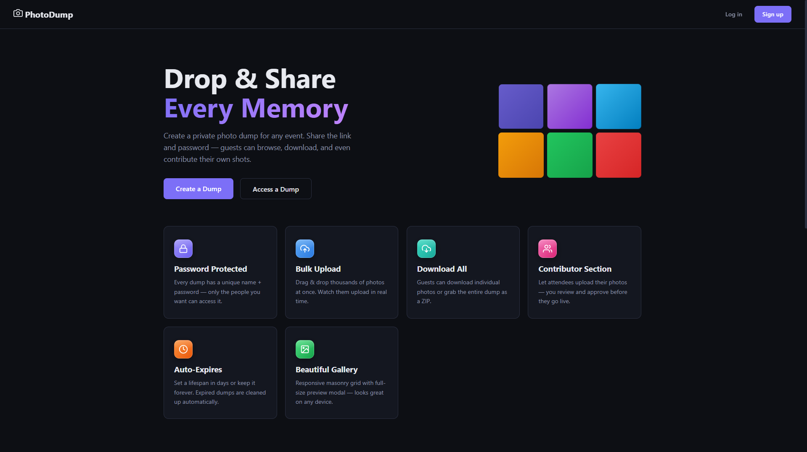
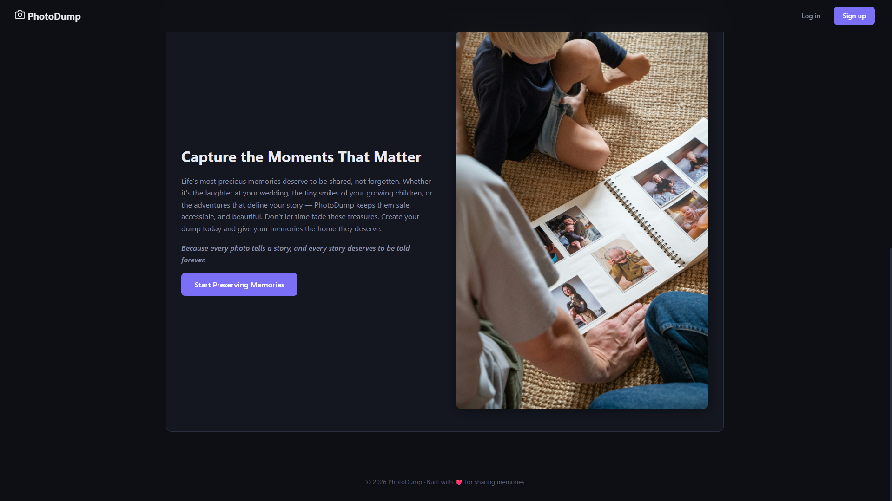

---

## ✨ Features

### 🔐 Authentication & Access Control
- **User Registration & Login** — JWT-based auth with bcrypt-hashed passwords
- **Password-Protected Dumps** — Every dump is locked behind its own access password
- **Dump Access Tokens** — Guests get scoped tokens that only unlock specific dumps

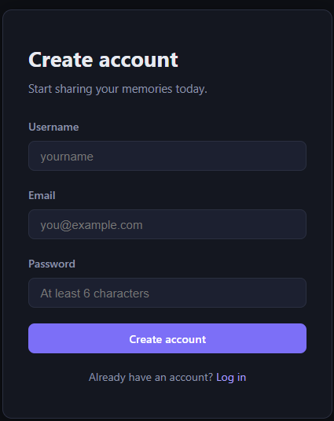
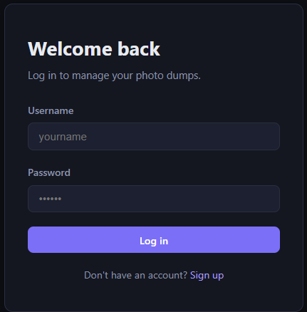
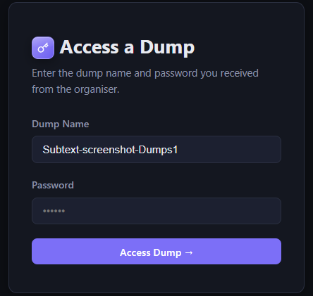

### 🗂️ Dump Management (Owner)
- **Create Dumps** — Name, description, access password, optional expiry, and custom background color
- **Dashboard** — View all your dumps at a glance with photo counts and sizes
- **Upload Photos** — Drag-and-drop or browse, with batch upload support
- **Approve Contributions** — Review and approve/reject photos submitted by guests
- **Delete Dumps** — Nuke everything including all photos with a single click
- **Share Info** — One-click copy of dump name and access URL to share with guests
- **Settings** — Customize the gallery background color with a full color wheel

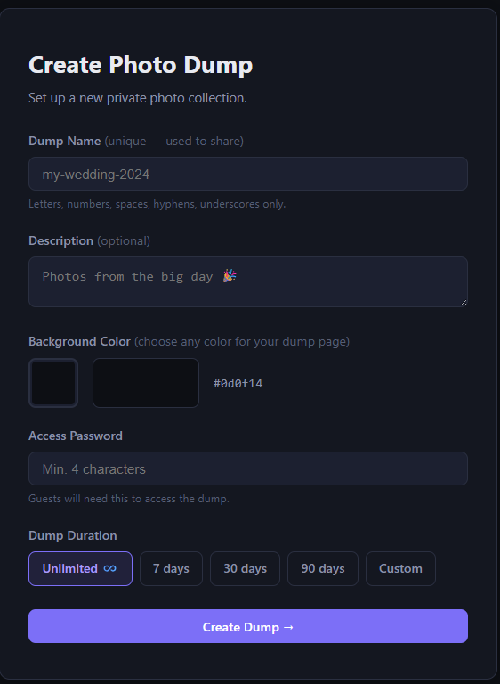
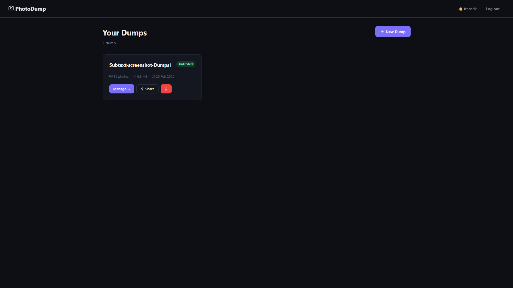
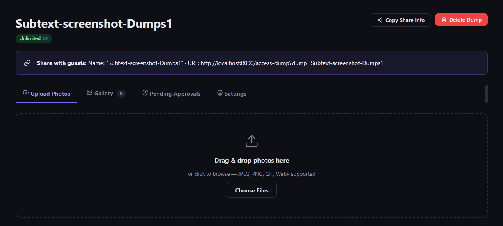
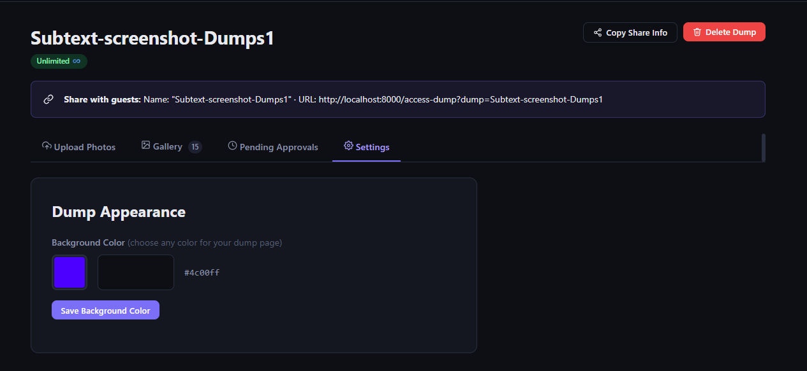

### 🖼️ Gallery & Viewing (Guest + Owner)
- **Pinterest-Style Masonry Layout** — Photos displayed in a beautiful multi-column layout with natural aspect ratios
- **Custom Background Color** — Each dump's gallery area uses the owner's chosen color
- **Lightbox Viewer** — Full-screen preview with keyboard navigation (← → Esc)
- **Select & Download** — Pick individual photos or download everything as a ZIP
- **Responsive Grid** — Adapts from 4 columns on desktop down to 1 on mobile

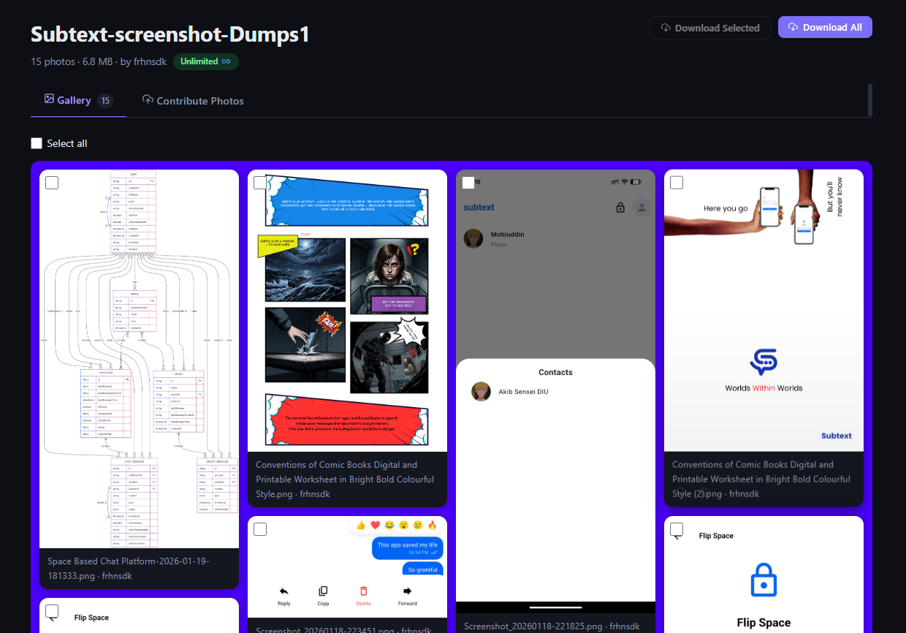
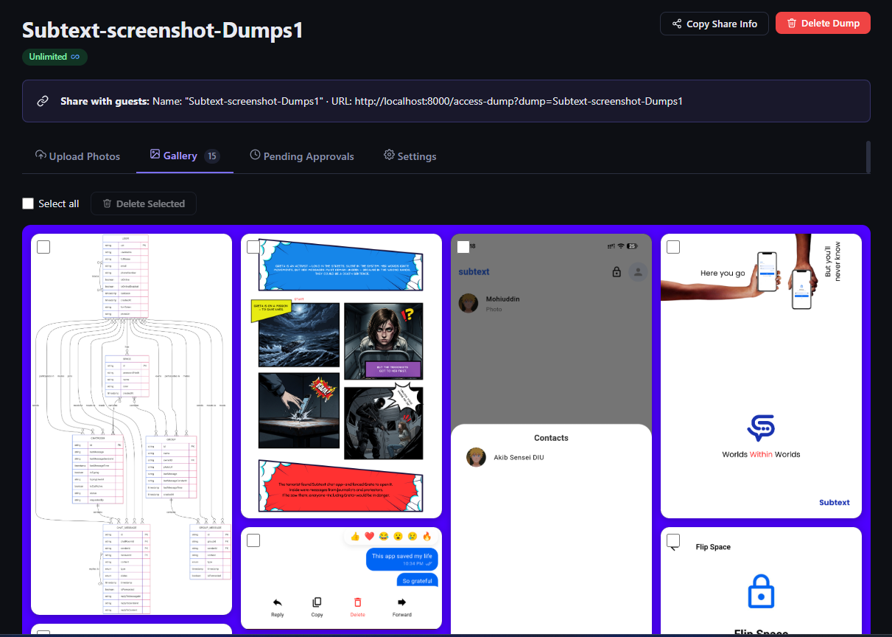

### 🤝 Guest Contributions
- **Contribute Photos** — Guests can upload their own shots to any dump they have access to
- **Contributor Tags** — Each photo shows who uploaded it
- **Pending Approval** — Owner reviews guest photos before they appear in the gallery

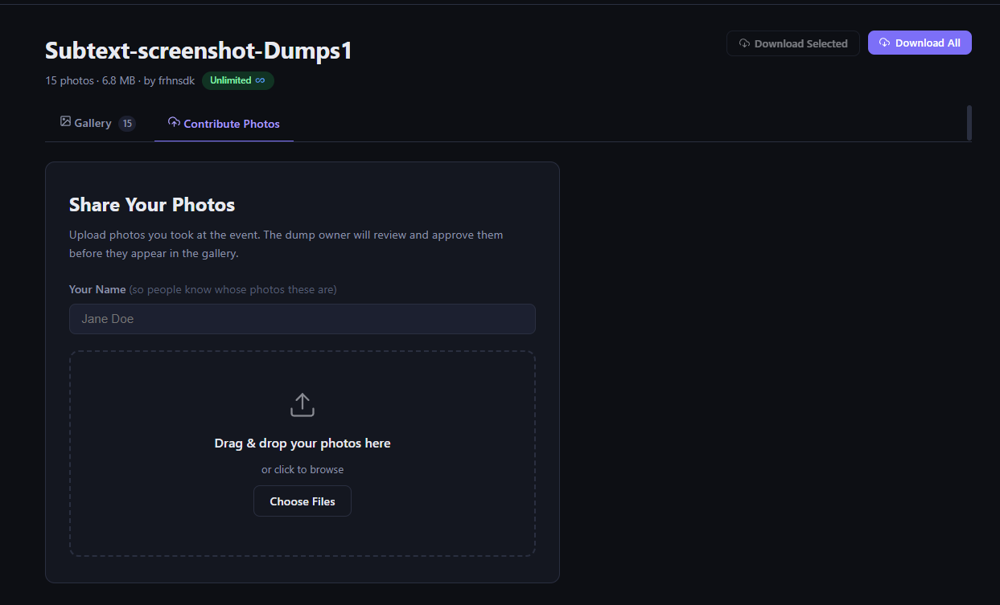

### ⚙️ Under the Hood
- **Thumbnail Generation** — Auto-generated via Pillow with aspect-ratio preservation
- **Auto-Expiry Cleanup** — Background scheduler (APScheduler) removes expired dumps hourly
- **Docker-Ready** — Two-container setup (app + PostgreSQL) with persistent volumes
- **No-Cache Static Middleware** — Ensures CSS/JS updates are always served fresh

---

## 🏗️ Architecture

```
PhotoDump/
├── docker-compose.yml          # Orchestrates app + PostgreSQL
├── Dockerfile                  # Multi-stage build (Python 3.12-slim)
├── backend/
│   ├── main.py                 # FastAPI app, middleware, static serving
│   ├── models.py               # SQLAlchemy ORM — User, Dump, Photo
│   ├── schemas.py              # Pydantic validation schemas
│   ├── database.py             # DB engine & session factory
│   ├── auth_utils.py           # JWT + bcrypt helpers
│   ├── requirements.txt        # Python dependencies
│   └── routers/
│       ├── auth.py             # /api/auth/* — register, login, me
│       ├── dumps.py            # /api/dumps/* — CRUD, access, share
│       └── photos.py           # /api/dumps/*/photos/* — upload, serve, download
├── frontend/
│   ├── index.html              # Landing page
│   ├── login.html / register.html
│   ├── dashboard.html          # Owner dashboard
│   ├── create-dump.html        # New dump form
│   ├── manage-dump.html        # Owner view — upload, gallery, pending, settings
│   ├── view-dump.html          # Guest view — gallery, contribute
│   ├── access-dump.html        # Enter dump name + password
│   ├── css/main.css            # All styles (dark theme, Pinterest grid, etc.)
│   └── js/
│       ├── api.js              # API client, auth helpers, image loader
│       ├── dashboard.js        # Dashboard logic
│       ├── create-dump.js      # Create dump form
│       ├── manage-dump.js      # Owner dump management
│       ├── view-dump.js        # Guest dump viewing
│       └── icons.js            # SVG icon helpers
└── photos/                     # Screenshots for this README
```

**Services:**

| Container | Image | Purpose |
|---|---|---|
| `photodump-app-1` | `python:3.12-slim` | FastAPI + Uvicorn serving API & frontend |
| `photodump-db-1` | `postgres:16-alpine` | PostgreSQL database |

**Persistent Volumes:**

| Volume | Mount | Stores |
|---|---|---|
| `pg_data` | `/var/lib/postgresql/data` | Database files |
| `photodumpstorage` | `/app/data` | Uploaded photos & generated thumbnails |

---

## 🚀 How to Run

### Prerequisites

- **Docker Desktop** installed and running
  - [Download for Windows](https://docs.docker.com/desktop/install/windows-install/)
  - [Download for macOS](https://docs.docker.com/desktop/install/mac-install/)
  - [Download for Linux](https://docs.docker.com/desktop/install/linux/)
- **Git** (to clone the repo)

### Step 1 — Clone the Repository

```bash
git clone https://github.com/YOUR_USERNAME/PhotoDump.git
cd PhotoDump
```

### Step 2 — Configure Environment (Optional)

Create a `.env` file in the project root to customize settings. If you skip this, sensible defaults are used:

```env
# Database
DB_NAME=photodump
DB_USER=photodump
DB_PASS=photodump

# App
APP_PORT=8000
SECRET_KEY=change_this_secret_in_production
```

> ⚠️ **For production:** Always change `SECRET_KEY` to a long random string and use a strong `DB_PASS`.

### Step 3 — Build & Start

```bash
docker compose up -d --build
```

This will:
1. Build the FastAPI app image (multi-stage, ~200MB)
2. Pull `postgres:16-alpine` if not cached
3. Start both containers
4. Wait for PostgreSQL to be healthy before starting the app
5. Auto-create all database tables on first run

### Step 4 — Open the App

Open your browser and go to:

```
http://localhost:8000
```

That's it! Register an account, create a dump, and start uploading.

### Stopping

```bash
docker compose down
```

> Your photos and database are saved in Docker volumes and persist across restarts.

### Full Reset (Deletes Everything)

```bash
docker compose down -v
```

> The `-v` flag removes volumes — all uploaded photos and database data will be permanently deleted.

---

## 🔧 Running Without Docker (Development)

If you prefer running directly on your machine:

### Prerequisites
- **Python 3.12+**
- **PostgreSQL 16+** running locally

### Setup

```bash
# 1. Install Python dependencies
cd backend
pip install -r requirements.txt

# 2. Set environment variables (PowerShell)
$env:DB_HOST = "localhost"
$env:DB_PORT = "5432"
$env:DB_NAME = "photodump"
$env:DB_USER = "photodump"
$env:DB_PASS = "photodump"
$env:SECRET_KEY = "dev-secret-key"
$env:DATA_DIR = "../data"
$env:FRONTEND_DIR = "../frontend"

# 3. Create the database
psql -U postgres -c "CREATE DATABASE photodump;"
psql -U postgres -c "CREATE USER photodump WITH PASSWORD 'photodump';"
psql -U postgres -c "GRANT ALL ON DATABASE photodump TO photodump;"

# 4. Start the server
uvicorn main:app --host 0.0.0.0 --port 8000 --reload
```

For **bash/zsh** (Linux/macOS), use `export` instead of `$env:`:
```bash
export DB_HOST=localhost
export DB_PORT=5432
# ... etc.
```

---

## 🧪 Running Tests

A PowerShell integration test script is included:

```powershell
.\test.ps1
```

This hits every API endpoint (register → login → create dump → upload → download → delete) and reports pass/fail.

---

## 📡 API Endpoints

### Auth
| Method | Endpoint | Description |
|---|---|---|
| `POST` | `/api/auth/register` | Create a new account |
| `POST` | `/api/auth/login` | Get JWT token |
| `GET` | `/api/auth/me` | Get current user info |

### Dumps
| Method | Endpoint | Description |
|---|---|---|
| `POST` | `/api/dumps/` | Create a new dump |
| `GET` | `/api/dumps/` | List your dumps |
| `POST` | `/api/dumps/access` | Get access token for a dump |
| `GET` | `/api/dumps/{name}` | Get dump details |
| `PATCH` | `/api/dumps/{name}` | Update dump settings (e.g. background color) |
| `DELETE` | `/api/dumps/{name}` | Delete dump and all photos |

### Photos
| Method | Endpoint | Description |
|---|---|---|
| `POST` | `/api/dumps/{name}/photos` | Upload photos (multipart) |
| `GET` | `/api/dumps/{name}/photos` | List photos in a dump |
| `GET` | `/api/dumps/{name}/photos/{id}/file` | Serve full image |
| `GET` | `/api/dumps/{name}/photos/{id}/thumb` | Serve thumbnail |
| `GET` | `/api/dumps/{name}/photos/{id}/download` | Download single photo |
| `GET` | `/api/dumps/{name}/download-all` | Download all as ZIP |
| `DELETE` | `/api/dumps/{name}/photos/{id}` | Delete a photo |
| `PATCH` | `/api/dumps/{name}/photos/{id}/approve` | Approve a contributed photo |

---

## 🗺️ Roadmap

### 🧠 Phase 2 — AI Face Recognition (Planned)

The next major feature is **AI-powered face recognition** so guests at an event can instantly find and download only the photos they appear in.

#### The Vision

> _You attend a wedding with 500 photos. Instead of scrolling through all of them, you upload a single selfie — and PhotoDump instantly shows you every photo where your face appears. One tap to download them all._

#### Planned Architecture

```
┌─────────────────────────────────────────────────────────┐
│                    PhotoDump App                        │
│                                                         │
│  ┌───────────┐   ┌──────────────┐   ┌───────────────┐  │
│  │  Upload    │──▶│  Face Index  │──▶│  Embeddings   │  │
│  │  Pipeline  │   │  Worker      │   │  Database     │  │
│  └───────────┘   └──────────────┘   └───────────────┘  │
│                         │                    │          │
│                         ▼                    ▼          │
│                  ┌──────────────┐   ┌───────────────┐  │
│                  │  face_recog  │   │  "Find My     │  │
│                  │  / InsightFace│   │   Photos"     │  │
│                  │  / FaceNet   │   │   Search UI   │  │
│                  └──────────────┘   └───────────────┘  │
└─────────────────────────────────────────────────────────┘
```

#### How It Will Work

1. **On Upload** — When photos are uploaded to a dump, a background worker detects all faces using a model like [InsightFace](https://github.com/deepinsight/insightface) or [face_recognition](https://github.com/ageitgey/face_recognition) and stores 128/512-dimensional face embeddings in the database.

2. **Face Embeddings Table** — A new `face_embeddings` table:
   ```
   face_embeddings
   ├── id              (PK)
   ├── photo_id        (FK → photos)
   ├── dump_id         (FK → dumps)
   ├── embedding       (vector — 512 floats)
   ├── bbox_x, y, w, h (face location in image)
   └── created_at
   ```

3. **"Find My Photos" Button** — Guests can upload a selfie or take a photo with their webcam. The app generates an embedding for their face and runs a **cosine similarity search** against all embeddings in that dump.

4. **Similarity Threshold** — Faces with similarity > 0.6 (tunable) are considered matches. The guest sees a filtered gallery of only their photos.

5. **Batch Download** — One-click ZIP download of all matched photos.

#### Technical Decisions To Make

| Decision | Options | Tradeoffs |
|---|---|---|
| **ML Model** | InsightFace (ArcFace) vs face_recognition (dlib) vs FaceNet | InsightFace is most accurate; dlib is simplest to install; FaceNet is well-documented |
| **Vector DB** | pgvector (PostgreSQL extension) vs in-memory numpy vs Pinecone | pgvector keeps everything in one DB; numpy is simple for small dumps; Pinecone scales but adds external dependency |
| **Processing** | Synchronous on upload vs background Celery worker vs on-demand | Background worker keeps uploads fast; on-demand avoids pre-processing cost |
| **GPU Support** | CPU-only vs CUDA vs ONNX Runtime | CPU works for ~100 photos; GPU needed for 1000+; ONNX is a good middle ground |
| **Privacy** | Process locally only vs optional cloud API | Local-only respects privacy; cloud API (AWS Rekognition) is simpler but sends photos externally |

#### Implementation Phases

- **Phase 2a** — Face detection & embedding extraction on photo upload (background worker)
- **Phase 2b** — "Find My Photos" UI with selfie upload + webcam capture
- **Phase 2c** — Cosine similarity search using pgvector
- **Phase 2d** — Filtered gallery view + batch download of matched photos
- **Phase 2e** — Face clustering (auto-group photos by person without needing a selfie)
- **Phase 2f** — Optional face tagging (owner can name detected faces)

#### New Dependencies (Planned)

```
insightface          # or face_recognition
onnxruntime          # Efficient model inference
pgvector             # PostgreSQL vector similarity extension
numpy                # Embedding math
opencv-python-headless  # Image preprocessing
celery + redis       # Background task queue (optional)
```

---

## 🛡️ Tech Stack

| Layer | Technology |
|---|---|
| **Backend** | Python 3.12, FastAPI, Uvicorn |
| **Database** | PostgreSQL 16 (Alpine) |
| **ORM** | SQLAlchemy 2.0 |
| **Auth** | JWT (python-jose) + bcrypt |
| **Images** | Pillow (thumbnails, processing) |
| **Scheduler** | APScheduler (expired dump cleanup) |
| **Frontend** | Vanilla HTML/CSS/JS (no framework) |
| **Containers** | Docker, Docker Compose |

---

## 📝 License

This project is open source. See [LICENSE](LICENSE) for details.
